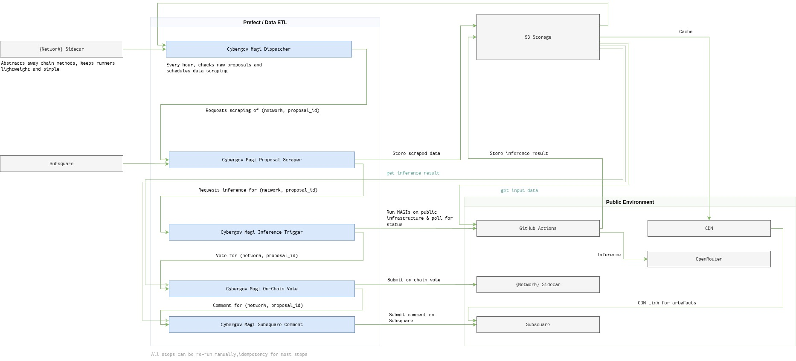

# cybergov

LLMs participating in governance decisions. Inspired from Evangelion - Magi system. 


## How this works

- The most important step, as usual, is the data. The data collection, sanitization and archival of the data is fully automated. 

The graph below illustrates roughly how Cybergov works: 




Note: In the event of a bug, or required intervention, we have to document things somehow. An idea would be to provide a correction file to the proposal folder. Like, when a proposal was altered significantly after we voted on it, or something else.


## How the data is stored

In order to ensure reproducibility, everything should ideally be driven of immutable files. Given that we'll work on files, we go with an S3 compatible storage, storing the files like so:

```
s3://.../proposals/{network}/{proposal_id}/
├── raw_subsquare_data.json		  # Raw data extracted from Subsquare
├── content.md 				      # Cleaned, extracted content for the LLMs
├── llm_analyses/           # NEW: Directory for individual LLM outputs
│   ├── balthazar.json
│   ├── caspar.json
│   └── melchior.json
├── manifest.json           # hashes of inputs / outputs for provenance
└── vote.json 		          # The final vote result
```

network will be one of polkadot, kusama, paseo. These files will be publicly accessible but served through a CDN. 

The vote will be bundled in a utility batch call, with the SHA256(manifest.json) as a justification! 

## Re-voting

For the odd case where a re-vote is required, due to changes or whatever, the current files will be moved to a sub-folder like so:

```
s3://.../proposals/{network}/{proposal_id}/vote_archive_{vote_index}
├── raw_subsquare_data.json
├── content.md
├── llm_analyses
│   ├── balthazar.json
│   ├── caspar.json
│   └── melchior.json
├── manifest.json
└── vote.json
```

The files at the root `s3://.../proposals/{network}/{proposal_id}/` always point to the latest vote, the other files are left as archive. Re-votes are only triggered if an issue is filed to the repository with a rationale & justification, or in the odd case where a "Please vote Nay" is added to a proposal. Anyone can request a re-vote. The rationale & justification as written in the GitHub issue will not be provided to the LLMs, all the contents of the rationale should be public and available on the proposal page. 

## llm_analyses/magi.json

```
{
  "model_name": "claude-3-opus",
  "timestamp_utc": "2023-10-28T13:30:00Z",
  "decision": "AYE",
  "confidence": 0.98,
  "rationale": "The proposal aligns with the stated goal of increasing network security by funding a well-respected audit firm. The budget is reasonable for the scope of work.",
  "raw_api_response": { ... } 
}
```

## vote.json

```
{
  "timestamp_utc": "2023-10-28T13:35:00Z",
  "is_conclusive": true, 
  "final_decision": "AYE",
  "is_unanimous": false,
  "summary_rationale": "The majority decision is AYE. Two models (Claude-3, GPT-4) found the proposal aligned with network security goals and had a reasonable budget. One model (Gemini-1.5) dissented, citing concerns about long-term maintenance costs not being factored in.",
  "votes_breakdown": [
    {
      "model": "balthazar",
      "decision": "AYE",
      "confidence": 0.98
    },
    {
      "model": "melchior",
      "decision": "AYE",
      "confidence": 0.91
    },
    {
      "model": "caspar",
      "decision": "NAY",
      "confidence": 0.85
    }
  ]
}
```


## Account structure

Governance proxies, as sub-accounts. Cannot be pure because we need to sign a message to post a comment on Subsquare. 

```
cybergov-main <- identity etc will be set here
├── cybergov/ikari (Polkadot Mainnet) <- will be sub identity with Governance Proxy for the main account
├── cybergov/akira (Kusama Mainnet)   
└── cybergov/akagi (Polkadot Testnet aka Paseo) 
```

When voting, one of the proxy posts the vote, along with the SHA256 of the manifest.json as a system remark. People then can indepently verify / scrutinize each vote decision. 

From any chain action of these accounts, it's possible to link it to a signed Subsquare comment. 
From any signed Subsquare comment, it's possible to follow the on-chain info, by correlating SHA256(manifest.json) with the system.remark input. 


### Chain specifics 

```
## Identity cannot be set with Vault on Paseo, cf https://github.com/novasamatech/metadata-portal/issues/1367 
CYBERGOV_PASEO_MAIN_PUBKEY      = "13Q56KnUmLNe8fomKD3hoY38ZwLKZgRGdY4RTovRNFjMSwKw"
CYBERGOV_PASEO_PROXY_PUBKEY     = "14zNhvyLnJKtYRmfptavEPWHuV9qEXZQNqXCjDmnvjrg1gtL"

CYBERGOV_POLKADOT_MAIN_PUBKEY   = "13Q56KnUmLNe8fomKD3hoY38ZwLKZgRGdY4RTovRNFjMSwKw"
CYBERGOV_POLKADOT_PROXY_PUBKEY  = "15DbGtWxaAU6tDPpdZhP9QyVZZWdSXaGCjD88cRZhhdCKTjE"

CYBERGOV_KUSAMA_MAIN_PUBKEY     = "EyPcJsHXv86Snch8GokZLZyrucug3gK1RAghBD2HxvL1YRZ"
CYBERGOV_KUSAMA_PROXY_PUBKEY    = "GWUyiyVmA6pbubhM9h7A6qGDqTJKJK3L3YoJsWe6DP7m67a"
```

## Notes on migration

Very smooth sailing:

- Sidecar: replace with the ones pointing to the AssetHubs
- Subsquare: need to test and make sure, maybe pause Cybergov for 1 or 2 days after migration once manual checks on Subsquare pass

## TODOs 

- [ ] Fix code duplication, there's a lot going on everywhere tbh, but v0 works 
- [ ] Clean up constants file, might be some duplication there too. The deployment IDs might not be necessary since we can fetch deployments by name
- [ ] Tests are manual for now, figure out some test infrastructure that's fully local, maybe unit tests too time permitting, waiting for Paseo People on Vault 
- [ ] Docs for people to run it themselves on local infrastructure 
- [ ] Await response from Subsquare team regarding the comment issue
- [ ] Re-introduce confidence measures
- [ ] Add the RAW JSON response to the `llm_analyses/*.jsons`
 

## Ideas

- "The White Rabbit" provided the idea of scraping AAG YouTube discussions and adding them to the context of the proposals. 
  - A good idea but complicated to automate fully, we'll need to automatically map what is being said to the proper proposals. False positives could be detrimental to data quality. 
- Add historical context to the proposals (RAG/embeddings), this will be prototyped. Historical data can be provided by Subsquare.
- Link vote_archive_{index} to to vote_archive_{index-1}, this way we ensure successive runs are linked, and the operator isn't fishing for favorable votes, although the latter would be visible (hash on-chain)
- Setting up the project, how to etc (note: there seems to be some messup with uv & pip when installing the requirements on the latest versions)
- Pick LLMs from a random list? 
- Have the SAME LLM compile the DSPy program? 